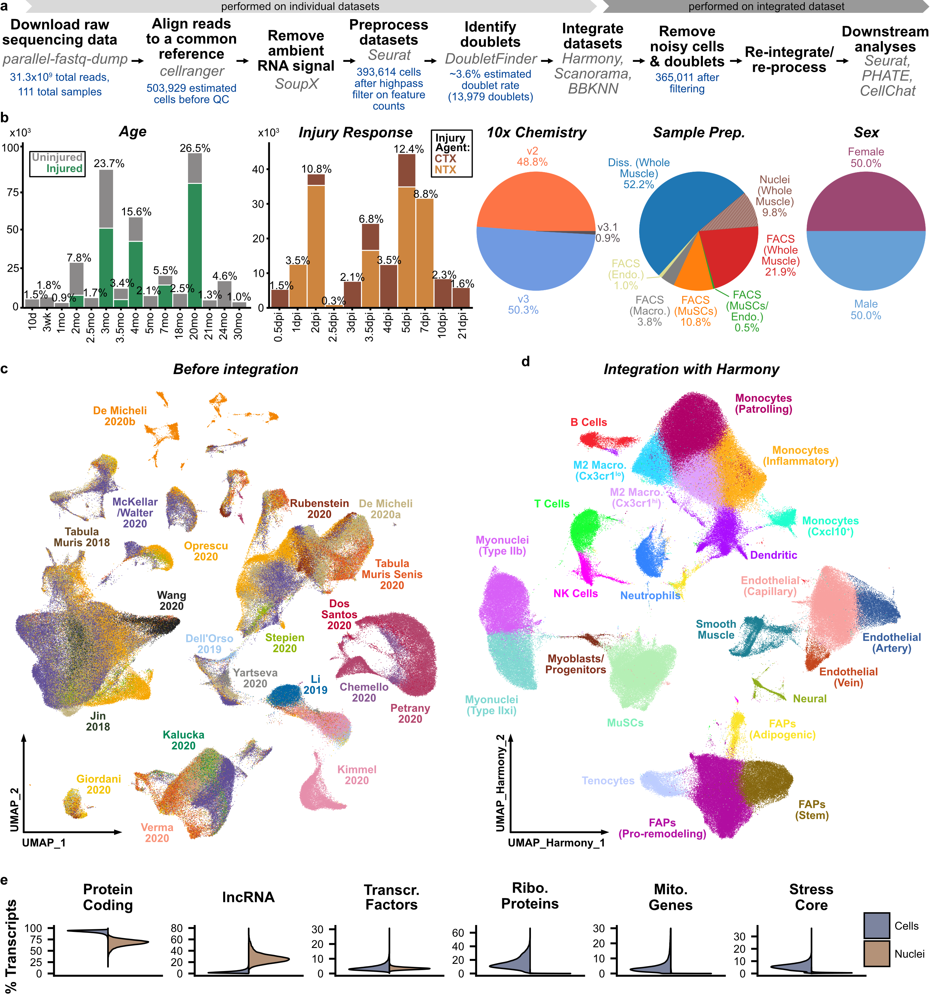

# scMuscle

## The Single-Cell Muscle Project (scMuscle) aims to collect, analyze, annotate, and provide to the research community skeletal muscle transcriptomic data. This includes tools to visualize and re-analyze these data in a consistent and repeatable manner.

We used more than 100 single-cell and single-nucleus RNA sequencing datasets, from 14 different research groups, to build an integrated transcriptomic reference of murine skeletal muscle.
The resulting compendium has ~365,000 cell/nucleus, which we have annotated using a suite of existing software tools (see linked preprint for more details).

Here, you'll find all of the R scripts used for the analysis and visualization (`R_scripts/`) as well as some of the supplemental resources we generated (`supplemental_data/`). These resources include metadata details, outputs from differential gene expression analysis, and some other useful gene lists.

You will also find the development version of the code used in our [web application](http://scmuscle.bme.cornell.edu/) (`web_app/`), as well as details on different versions of the data (`data_versions/`)

## Links:
**Code and supplemental data from McKellar et al, *Communications Biology*, 2021:**  
- [link to final manuscript](https://www.nature.com/articles/s42003-021-02810-x) (copy of the .pdf is available in this repo)
- [link to bioRxiv preprint](https://www.biorxiv.org/content/10.1101/2020.12.01.407460v2)

**Web application to explore these data can be found [here](http://scmuscle.bme.cornell.edu/)**

**Fully processed Seurat and CellChat objects from this study can be downloaded [here](https://datadryad.org/stash/dataset/doi:10.5061%2Fdryad.t4b8gtj34)**

**Raw data from Spatial RNA sequencing (Visium) can be found [here](https://www.ncbi.nlm.nih.gov/geo/query/acc.cgi?acc=GSE161318)**

**Raw data from new 10x Chromium datasets can be found [here](https://www.ncbi.nlm.nih.gov/geo/query/acc.cgi?acc=GSE162172)**
